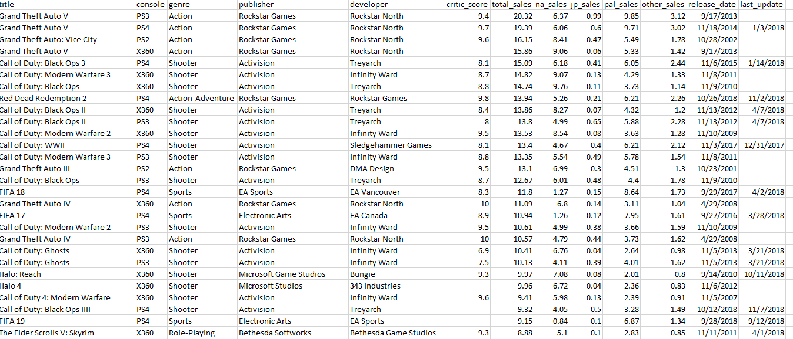
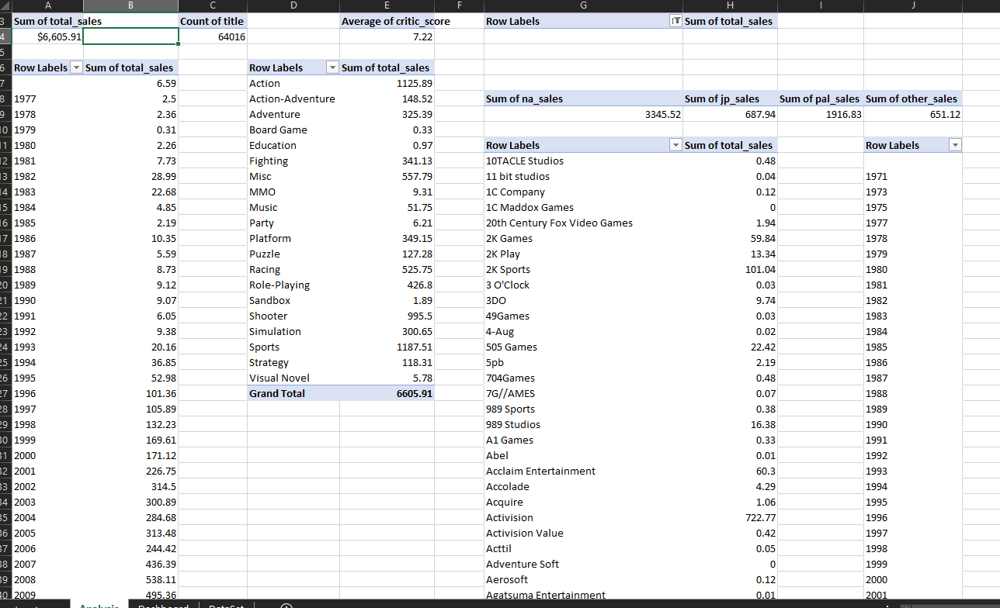
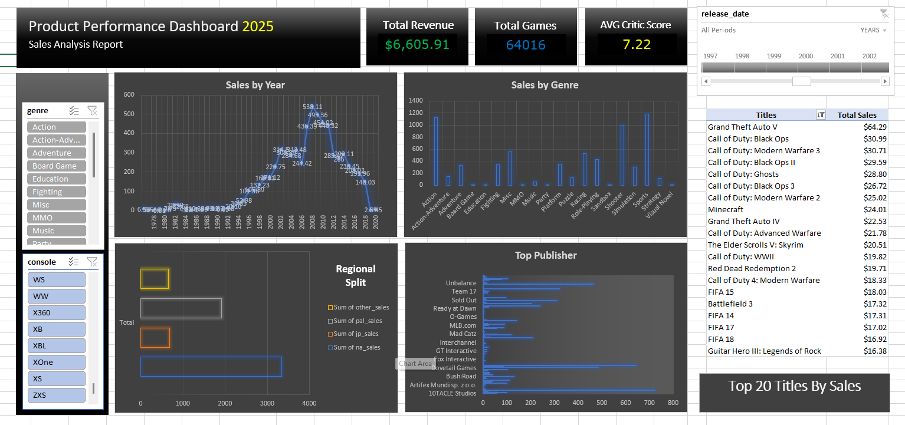

# Video Game Sales Analysis Dashboard (Excel)
## Project Overview
This project presents an interactive Video Game Sales Performance Dashboard built using Microsoft Excel (Pivot Tables + Slicers + Timeline + Charts).
The objective of this project was to:
Analyze global video game sales performance
Compare regional market trends
Identify top-performing consoles, genres, publishers, and titles
Explore the relationship between critic scores and sales
Build a clean, interactive dashboard using Excel only
This project demonstrates data cleaning, transformation, pivot modeling, and dashboard design skills.

## Dataset Description
The dataset contains over 64,000 video game records, including:

# Categorical Columns
* Title
* Console
* Genre
* Publisher
* Developer

## Numeric Columns
* Total Sales
* NA Sales
* JP Sales
* PAL Sales
* Other Sales
* Critic Score

## Date Columns
* Release Date
* Last Update

## Data Preparation Steps
Before building the dashboard, the following transformations were performed:
Converted release_date into proper Date format.
Extracted Release Year for yearly trend analysis.
Replaced missing sales values with 0.
Verified total sales consistency across regional sales.
Removed irrelevant or zero-sales records where necessary.
Created calculated measures using Pivot Tables.

## Pivot Table Model

The dashboard is powered entirely using Pivot Tables.
Separate pivot tables were created for:
Total Revenue (Sum of Total Sales)
Total Games (Count of Titles)
Average Critic Score
Sales by Year
Sales by Genre
Regional Sales Split
Top Publishers
Top 20 Titles by Sales
Slicers were connected across multiple pivot tables to ensure synchronized filtering.

## Dashboard Components

This Excel dashboard analyzes global video game sales performance by console, genre, publisher, region, and release year using Pivot Tables and interactive slicers. It helps identify top-performing markets, trends over time, leading publishers, and high-selling titles while allowing dynamic filtering for deeper insights.

## Interactive Feature
* Genre slicer
* Console slicer
* Timeline filter (Release Year)
* Cross-filtered pivot tables
* Users can dynamically analyze performance by:
* Console
* Year
* Genre

## Business Questions This Dashboard Answers
* Which console generates the highest revenue?
* Which genre performs best globally?
* How do regional markets differ?
* Are sales declining in recent years?
* Which publishers dominate the industry?
